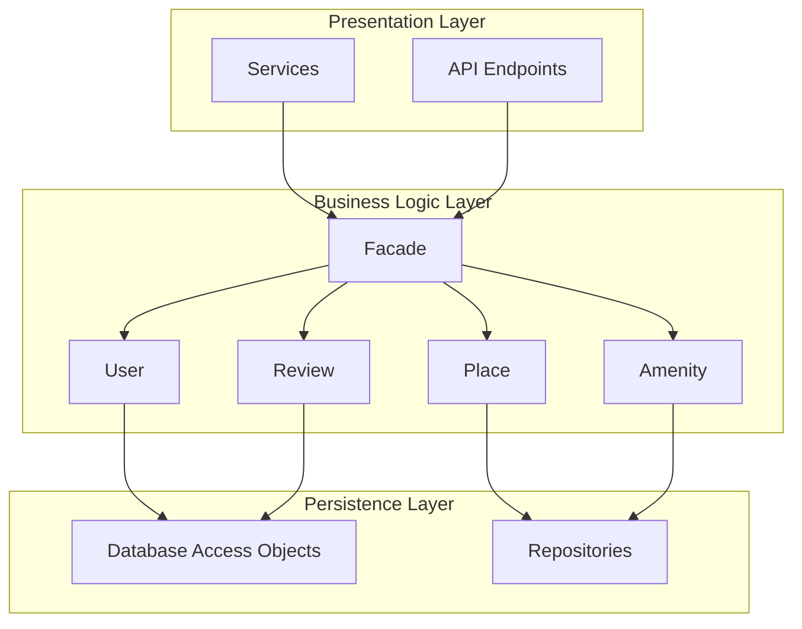
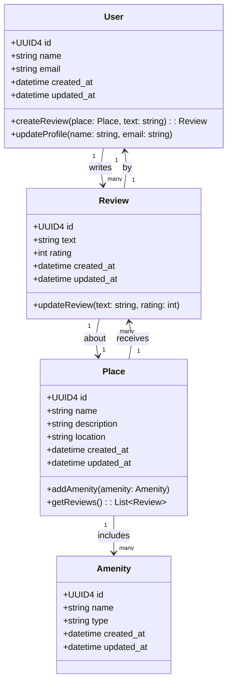
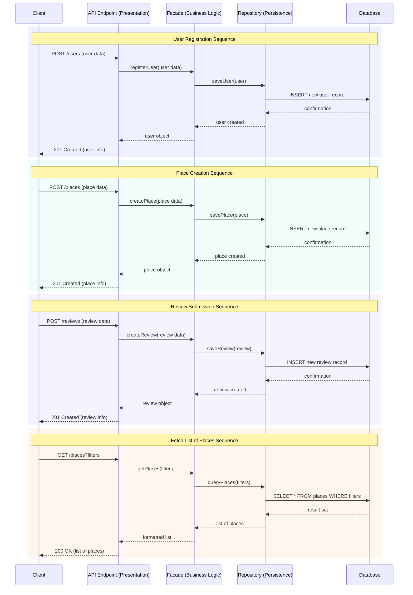

Architecture:

Package Diagram

```mermaid

flowchart TD
    subgraph P[Presentation Layer]
        direction TB
        Svc[Services]
        API[API Endpoints]
    end

    subgraph B[Business Logic Layer]
        direction TB
        User[User]
        Place[Place]
        Review[Review]
        Amenity[Amenity]
        Facade[Facade]
    end

    subgraph D[Persistence Layer]
        direction TB
        DAO[Database Access Objects]
        Repo[Repositories]
    end

    %% Communication pathways (Facade pattern)
    Svc --> Facade
    API --> Facade
    Facade --> User
    Facade --> Place
    Facade --> Review
    Facade --> Amenity
    User --> DAO
    Place --> Repo
    Review --> DAO
    Amenity --> Repo
```

Class Diagram

```mermaid

classDiagram
    class User {
        +UUID4 id
        +string name
        +string email
        +datetime created_at
        +datetime updated_at
        +createReview(place: Place, text: string): Review
        +updateProfile(name: string, email: string)
    }

    class Place {
        +UUID4 id
        +string name
        +string description
        +string location
        +datetime created_at
        +datetime updated_at
        +addAmenity(amenity: Amenity)
        +getReviews(): List~Review~
    }

    class Review {
        +UUID4 id
        +string text
        +int rating
        +datetime created_at
        +datetime updated_at
        +updateReview(text: string, rating: int)
    }

    class Amenity {
        +UUID4 id
        +string name
        +string type
        +datetime created_at
        +datetime updated_at
    }

    %% Relationships and multiplicities
    User "1" --> "many" Review : writes
    Place "1" --> "many" Review : receives
    Place "1" --> "many" Amenity : includes
    Review "1" --> "1" Place : about
    Review "1" --> "1" User : by
```

Sequence Diagram

```mermaid

sequenceDiagram
    participant Client
    participant API as API Endpoint (Presentation)
    participant Facade as Facade (Business Logic)
    participant Repo as Repository (Persistence)
    participant DB as Database

    %% --- 1. User Registration ---
    rect rgb(238,242,255)
    Note over Client,DB: User Registration Sequence
    Client->>API: POST /users (user data)
    API->>Facade: registerUser(user data)
    Facade->>Repo: saveUser(user)
    Repo->>DB: INSERT new user record
    DB-->>Repo: confirmation
    Repo-->>Facade: user created
    Facade-->>API: user object
    API-->>Client: 201 Created (user info)
    end

    %% --- 2. Place Creation ---
    rect rgb(240,253,250)
    Note over Client,DB: Place Creation Sequence
    Client->>API: POST /places (place data)
    API->>Facade: createPlace(place data)
    Facade->>Repo: savePlace(place)
    Repo->>DB: INSERT new place record
    DB-->>Repo: confirmation
    Repo-->>Facade: place created
    Facade-->>API: place object
    API-->>Client: 201 Created (place info)
    end

    %% --- 3. Review Submission ---
    rect rgb(245,243,255)
    Note over Client,DB: Review Submission Sequence
    Client->>API: POST /reviews (review data)
    API->>Facade: createReview(review data)
    Facade->>Repo: saveReview(review)
    Repo->>DB: INSERT new review record
    DB-->>Repo: confirmation
    Repo-->>Facade: review created
    Facade-->>API: review object
    API-->>Client: 201 Created (review info)
    end

    %% --- 4. Fetching List of Places ---
    rect rgb(255,247,237)
    Note over Client,DB: Fetch List of Places Sequence
    Client->>API: GET /places?filters
    API->>Facade: getPlaces(filters)
    Facade->>Repo: queryPlaces(filters)
    Repo->>DB: SELECT * FROM places WHERE filters
    DB-->>Repo: result set
    Repo-->>Facade: list of places
    Facade-->>API: formatted list
    API-->>Client: 200 OK (list of places)
    end
```