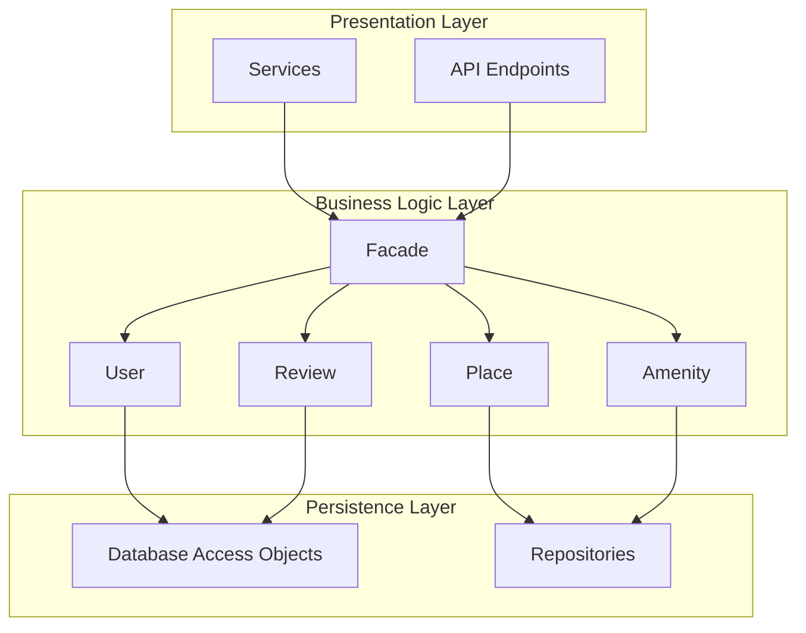
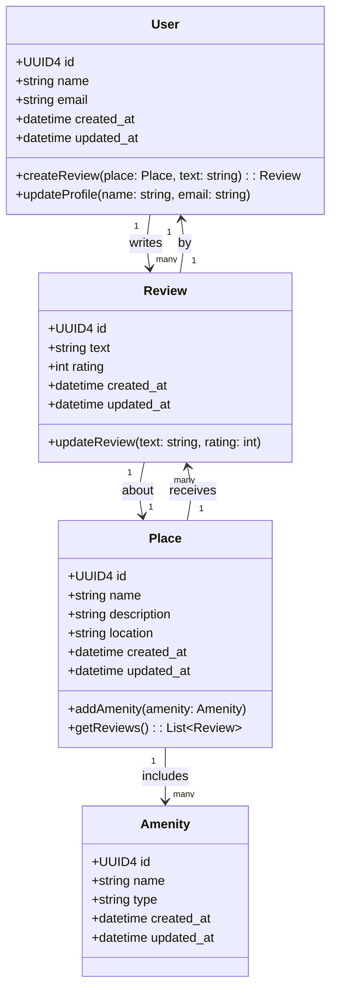
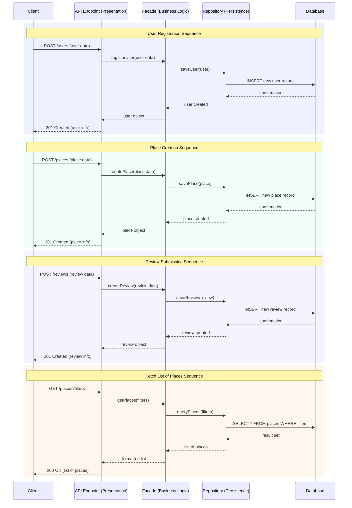

**HBnB Technical Architecture Document**
1. **Introduction**

This document provides a comprehensive overview of the system architecture and design of the HBnB application. It serves as a blueprint for the development process, guiding implementation decisions and ensuring a clear understanding of how different components of the system interact.

The document includes:

- A high-level package diagram illustrating the layered architecture
- A detailed class diagram for the business logic layer
- Sequence diagrams describing API interactions

The goal of this document is to present a clear, structured, and maintainable design that separates concerns and promotes scalability.

---

2. **High-Level Architecture**
**2.1 Overview**

The HBnB application follows a layered architecture pattern, which separates the system into three main layers:

- Presentation Layer
- Business Logic Layer
- Persistence Layer

Additionally, the system uses the Facade pattern to provide a unified interface between the Presentation Layer and the Business Logic Layer.

---

**2.2 Package Diagram**

---

**2.3 Explanation**

**Presentation Layer**

This layer is responsible for handling all interactions with external users or systems. It includes API endpoints and service components that:

- Receive and validate incoming requests
- Forward requests to the facade
- Return responses to the client

This layer does not contain any business logic.

---

**Business Logic Layer**

This is the core of the application where all business rules and domain logic are implemented. It includes key entities such as:

- User
- Place
- Review
- Amenity

These entities encapsulate the system's behavior and enforce constraints and rules.

The Facade is also part of this layer and acts as the main entry point for all operations. It simplifies interactions by providing a consistent interface to the Presentation Layer.

---

**Persistence Layer**

This layer is responsible for data storage and retrieval. It includes repository classes that:

- Perform CRUD operations
- Interact with the database

This layer is isolated from business logic and does not contain decision-making processes.

---

**2.4 Design Decisions**

- **Layered Architecture** was chosen to enforce separation of concerns and improve maintainability.
- **Facade Pattern** was implemented to decouple the Presentation Layer from the Business Logic Layer.
- Direct communication between the Presentation Layer and Persistence Layer is intentionally avoided.

---

3. **Business Logic Layer**

**3.1 Overview**

The Business Logic Layer defines the core entities and their relationships. It ensures that all operations follow the rules and constraints of the system.

---

**3.2 Class Diagram**

---

**3.3 Key Entities**

**User**

Represents a system user. Responsible for managing user-related data and actions.

**Place**

Represents a property available in the system. Contains information such as location, description, and ownership.

**Review**

Represents feedback provided by users for places. Includes rating and comments.

**Amenity**

Represents additional features associated with places.

---

**3.4 Relationships**

- A User can create multiple Reviews
- A Place can have multiple Reviews
- A Place can have multiple Amenities

These relationships define how entities interact and ensure consistency within the system.

---

**3.5 Design Decisions**

- Entities are designed to encapsulate both data and behavior.
- Relationships between entities are clearly defined to avoid ambiguity.
- Business rules are enforced within this layer to ensure data integrity.

---

4. **API Interaction Flow**

**4.1 Overview**

Sequence diagrams illustrate how different components interact during API calls. They show the flow of data and control between the Presentation Layer, Facade, Business Logic, and Persistence Layer.

---

**4.2 Sequence Diagrams**

---

**4.3 Example Flow Explanation**

A typical API request follows this sequence:

 1)The client sends a request to the API endpoint.
 2)The API validates the request data.
 3)The request is forwarded to the Facade.
 4)The Facade coordinates the required operations in the Business Logic Layer.
 5)The Business Logic Layer interacts with the Persistence Layer to retrieve or store data.
 6)The result is returned back through the Facade to the API.
 7)The API sends the final response to the client.

---

**4.4 Design Decisions**
- The Facade centralizes communication and simplifies API interactions.
- Sequence diagrams ensure clarity in how components collaborate.
- The architecture enforces a strict flow of control to maintain system integrity.

---

5. **Conclusion**

This document provides a structured overview of the HBnB system architecture. By combining layered architecture with the Facade pattern, the design ensures scalability, maintainability, and clear separation of concerns.

The diagrams and explanations in this document serve as a foundation for future development and implementation.